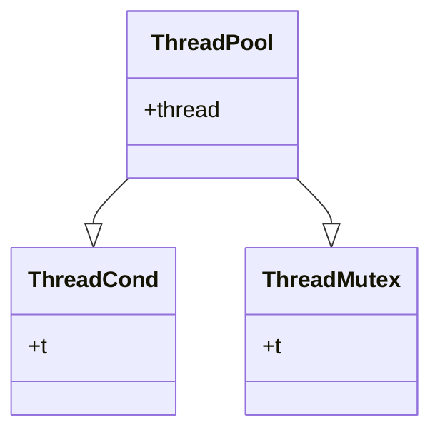
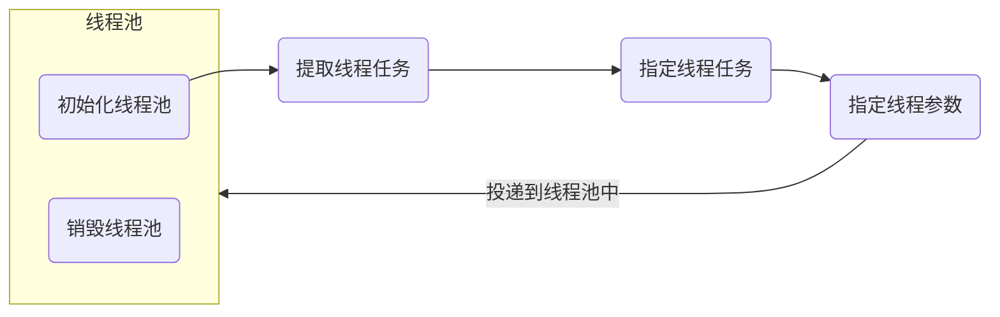

# ThreadPool
[English Version](README_en.md)

#### 介绍
首先要把请求函数写成线程函数，然后准备线程的相关参数。开启线程，等待其结束。

项目地址(https://github.com/doctordragon666/http-server.git)

公开项目，可以随时参观

#### 软件架构
软件架构说明




#### 安装教程

1. 安装`CMake`，使用基本的CMake流程即可

   ```shell
   $ cmake ..
   $ make
   ```

2. 如果在`windows`上，可以通过引入头文件的方式使用

#### 使用说明

`main`函数中有详细的代码，这里只做简单的流程说明




#### 参与贡献

1.  Fork 本仓库
2.  新建分支
3.  提交代码
4.  新建 Pull Request