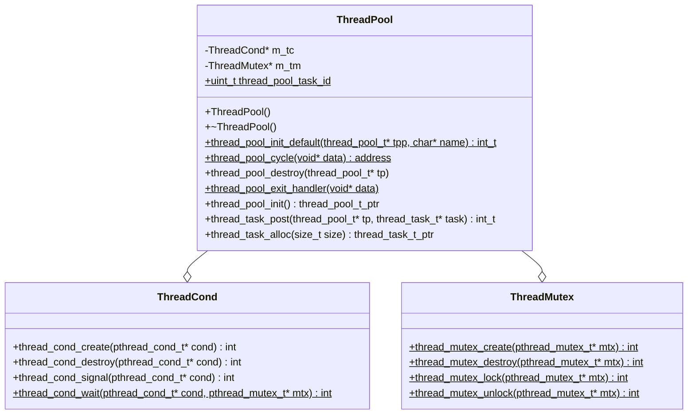
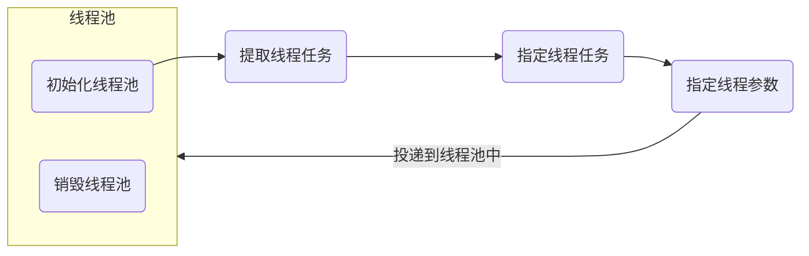

# ThreadPool
[English Version](README_en.md)

[项目地址](https://github.com/doctordragon666/http-server.git)

#### 介绍
首先要把请求函数写成线程函数，然后准备线程的相关参数。开启线程，等待其结束。

一个简单的线程池，用的均是Linux下的C语言API，无任何其他库引入。数据结构用的是链表的队列。

#### 软件架构
软件架构说明

关键结构体

```cpp
//跨平台类型定义
typedef intptr_t        int_t;
typedef uintptr_t       uint_t;
typedef unsigned long         atomic_uint_t;

//全局线程变量定义
#define  OK          0
#define  ERROR      -1
#define DEFAULT_THREADS_NUM 4     //默认线程数
#define DEFAULT_QUEUE_NUM  65535  //最大任务队列长度
#define thread_pool_queue_init(q)                                         \
    (q)->first = NULL;                                                    \
    (q)->last = &(q)->first

//线程任务
typedef struct thread_task_s {
	struct thread_task_s* next;	//下一个任务
	uint_t  id;					//具体任务的id
	void* ctx;					//参数，上下文
	void (*handler)(void* data);//处理函数
}thread_task_t;

//线程任务队列
typedef struct {
	thread_task_t* first;//头指针
	thread_task_t** last;//尾指针
} thread_pool_queue_t;//单链表

//线程池
struct thread_pool_t {
	pthread_mutex_t        mtx;		//锁
	thread_pool_queue_t   queue;	//线程池队列
	int_t                 waiting;	//等待的任务数量
	pthread_cond_t         cond;	//条件变量

	char* name;						//线程池的名字
	uint_t                threads;	//线程的数量
	int_t                 max_queue;//最大队列长度
};
```

关键类，因为`mermaid`渲染问题，指针使用`ptr`后缀，`void*`类型用`address`代替




#### 安装教程

1. 安装`CMake`，使用基本的CMake流程即可

   ```shell
   $ cmake ..
   $ make
   ```

2. 如果在`windows`上，可以通过引入头文件的方式使用

#### 使用说明

`main`函数中有详细的代码，这里只做简单的流程说明



#### 运行结果

```shell
$ ./ThreadPool
thread_pool_init, name: default ,threads: 4 max_queue: 65535
thread in pool "default" started
thread in pool "default" started
thread in pool "default" started
task #0 added to thread pool "default"
run task #0 in thread pool "default"
thread in pool "default" started
Hello, this is 1th test.index=0
complete task #0 in thread pool "default"
task #1 added to thread pool "default"
run task #1 in thread pool "default"
Hello, this is 2th test.index=0
task #2 added to thread pool "default"
run task #2 in thread pool "default"
run task #3 in thread pool "default"
Hello, this is 3th test.index=0
complete task #1 in thread pool "default"
arg1: 666, arg2: 888
complete task #2 in thread pool "default"
task #3 added to thread pool "default"
task #4 added to thread pool "default"
run task #4 in thread pool "default"
task #5 added to thread pool "default"
run task #5 in thread pool "default"
task #6 added to thread pool "default"
run task #6 in thread pool "default"
```

#### 参与贡献

发邮件到teacher_jiang03@qq.com即可。

本项目关闭，因为C++有了比较好的线程库，该线程库的开销可能好不了很多。